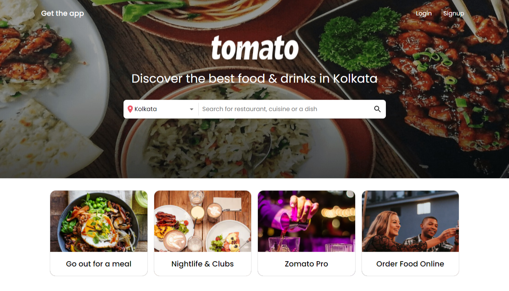

# `Zomato Clone(tomato)`

In the project directory, A End to End clone of [zomato](https://www.zomato.com/) is made. User can order food online , search for popular restaurants, search for restaurants located nearby, can sort the items by popularity-high to low, delivery rating and can also filter item according to cuisines, cost and ratings. User have to `sign in` or `sign up` before checkout and make payments.

User can `sign in` or `sign up` using `google sign in` or through `email verification`.

#### Project Screenshots

<table>
   <tr align=center>
     <td  colspan=3>Landing Page </td>
  </tr>
  <tr>
    <td>Restaurant Page </td>
    <td>Collection Page </td>
    <td>Profile Update Page</td>
  <tr>
   <td>Profile Update Page</td>
     <td>Profile Update Page</td>
   <td>Profile Update Page</td>
  </tr>
</table>

## Built With

<table  align=center>
  <tr>
 <td align=center> </td>
  <td align=center> </td>
     <td align=center> </td>
    <td align=center> </td>
     <td align=center> </td>
  </tr>
   <tr>
    <td align=center>  </td>
   <td align=center> </td>
    <td align=center> </td>
     <td align=center> </td>
     <td align=center> </td>
  </tr>

</table>

### `Functionalities`

- User can order food online based on location
- OAuth login through google
- Google Maps Integrated
- RazorPay Integrated for Payment
- Similar properties suggestion feature

### `Installation and Setup Instructions`

Clone down this repository. You will need `node` and `npm` installed globally on your machine.
Installation:
`npm install`
To Run Test Suite:
`npm test`
To Start Server:
`npm start`
To Visit App:
`localhost:3000/`

## `Tools Used`

#### FRONTEND

- `React`
  To learn React, check out the [React documentation](https://reactjs.org/).
- `Redux`
  To learn Redux, check out the [Redux documentation](https://redux.js.org/).
- `Bootstrap`

### INTEGRATION

- `Google place autocomplete`
- `Google maps api`
- `Razor Pay`

#### BACKEND

- `npm install`
- `nodemon server.js`

### `Deployement`

deployement tool used: AWS(Amazon Web Services)

👤 **Akash Pathak**

- Github: [@0prodigy](https://github.com/0prodigy)
- Twitter: [@pathakprodigy](https://twitter.com/pathakprodigy)
- Linkedin: [Akash Pathak](https://www.linkedin.com/in/akash-pathak-0796a7165)
- Email: (pathakvikash9211@gmail.com)

👤 **Manish Kumar**

- Github: [@Manish-kumar-DEV](https://github.com/Manish-kumar-DEV)
- Linkedin: [manish-kumar-dev](https://www.linkedin.com/in/manish-kumar-dev/)
- Email: (manish1771999@gmail.com)

👱‍♀️ **Gargi Das**

- Github: [@Gargi-123](https://github.com/Gargi-123)
- Twitter: [@GargiDas1079419](https://twitter.com/GargiDas1079419)
- Linkedin: [Gargi Das](https://www.linkedin.com/in/gargi-das-57701b197/)
- Email: (dasgargi100@gmail.com)

## 🤝 Contributing

Contributions, issues and feature requests are welcome!

Feel free to check the [issues page](https://0prodigy.github.io/monk-arena/issues).

## Show your support

Give a ⭐️ if you like this project!

## Acknowledgments

- We take all the responsiblity for every single line of code. The desgin inspire from Zomato.
